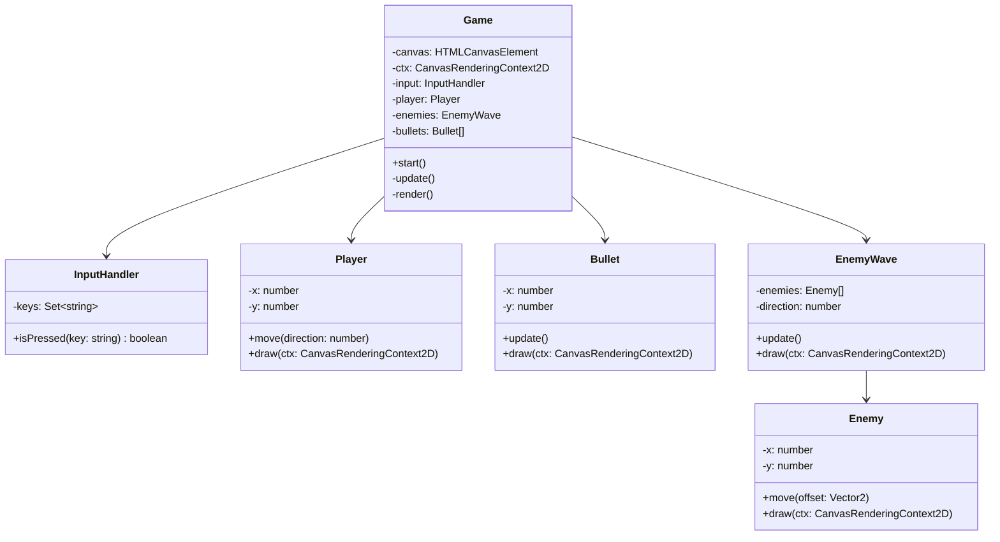

# Game Base Implementation Plan

This plan outlines the steps to implement the core mechanics of the Space Invaders game using TypeScript, following the project's strict architectural rules.

## Architecture Overview

To comply with the "Max 2 arguments per method" and "Max lines per file" rules, the game will be decomposed into several specialized classes.

### Component Diagram

## Detailed Implementation Steps

### 1. Input Handling
- **File**: [`src/ts/InputHandler.ts`](src/ts/InputHandler.ts)
- **Description**: Create a class that listens to `keydown` and `keyup` events.
- **Methods**: 
    - `constructor()`: Set up event listeners.
    - `isPressed(key: string)`: Return boolean if key is in the active set.

### 2. Player Entity
- **File**: [`src/ts/entities/Player.ts`](src/ts/entities/Player.ts)
- **Description**: Represent the player ship as a geometric figure (triangle or rectangle).
- **Constraints**: 
    - Constructor should take an object if more than 2 params are needed.
    - `draw` method takes only `ctx`.

### 3. Bullet Entity
- **File**: [`src/ts/entities/Bullet.ts`](src/ts/entities/Bullet.ts)
- **Description**: Handle projectile movement and rendering.
- **Movement**: Upward at a constant speed.

### 4. Enemy Entity
- **File**: [`src/ts/entities/Enemy.ts`](src/ts/entities/Enemy.ts)
- **Description**: Represent individual aliens as geometric figures.

### 5. Enemy Wave Management
- **File**: [`src/ts/entities/EnemyWave.ts`](src/ts/entities/EnemyWave.ts)
- **Description**: Manage a collection of 30 enemies.
- **Logic**: 
    - Move side-to-side.
    - When hitting a boundary, move down and reverse horizontal direction.

### 6. Game Orchestration
- **File**: [`src/ts/Game.ts`](src/ts/Game.ts)
- **Description**: Integrate all components into the game loop.
- **Logic**:
    - Handle player input for movement and shooting.
    - Update bullets and check for collisions.
    - Update enemy wave and check for lose condition (enemies reaching bottom).
    - Check for win condition (all enemies destroyed).

### 7. Main Entry Point
- **File**: [`src/ts/main.ts`](src/ts/main.ts)
- **Description**: Initialize the `Game` class and start the loop.

## Code Structure Patterns

- **Geometric Figures**:
    - Player: Green rectangle at the bottom.
    - Enemy: Red rectangle in a grid.
    - Bullet: White thin rectangle.
- **Night Mode**: 
    - Canvas background: Black.
    - Outlines/Fills: High contrast colors (Green, Red, White).

## Rules Compliance Check
- [x] Max 2 arguments per method.
- [x] Max 2 levels of nesting.
- [x] Max 50 lines per method.
- [x] Max 200 lines per file.
- [x] No frameworks.
- [x] TypeScript only.
