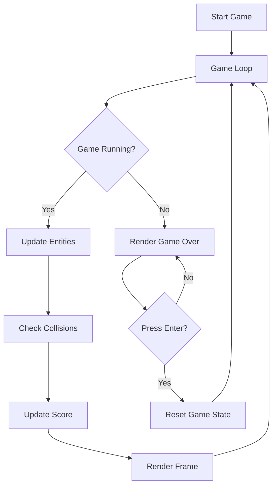

# Plan: Space Invaders Improvements (TODO-4)

## Overview
This plan outlines the implementation of several improvements and bug fixes for the Space Invaders game, including horizontal wrap-around for enemies, formation updates, UI enhancements, and gameplay constraints.

## Proposed Changes

### 1. Game Configuration & Dimensions
- **File**: [`src/ts/Game.ts`](src/ts/Game.ts)
- **Action**: Increase canvas dimensions to 1000x800.
- **Action**: Define `private readonly PADDING: number = 20` to establish game boundaries.
- **Action**: Update `enemyConfig` to `rows: 5, cols: 6`.

### 2. Scoring System
- **File**: [`src/ts/Game.ts`](src/ts/Game.ts)
- **Action**: Add `private score: number = 0`.
- **Action**: In `update()`, increment `score` by 10 for each enemy destroyed.
- **Action**: In `render()`, display the score at the top-left of the canvas.

### 3. Game Restart Logic
- **File**: [`src/ts/Game.ts`](src/ts/Game.ts)
- **Action**: Implement a `reset()` method to re-initialize player, enemies, bullets, and score.
- **Action**: In `update()`, check for `Enter` key press when `gameRunning` is false to trigger `reset()`.
- **Action**: In `render()`, add a note "Press Enter to Restart" below the "Game Over" or "You Win!" title.

### 4. Enemy Movement (Horizontal Wrap-around)
- **File**: [`src/ts/entities/EnemyWave.ts`](src/ts/entities/EnemyWave.ts)
- **Action**: Remove the direction-flipping and vertical dropping logic from `update()`.
- **Action**: Implement individual horizontal wrap-around for each enemy.
  - If an enemy's right edge exceeds `canvasWidth - PADDING`, set its `x` to `PADDING`.
  - If an enemy's left edge is less than `PADDING`, set its `x` to `canvasWidth - PADDING - width`.
- **File**: [`src/ts/entities/Enemy.ts`](src/ts/entities/Enemy.ts)
  - Add `setX(newX: number)` method to allow the wave manager to reposition enemies.

### 5. Player Boundaries
- **File**: [`src/ts/entities/Player.ts`](src/ts/entities/Player.ts)
- **Action**: Update the bounds check in `update()` to use `PADDING` instead of `0` and `canvasWidth`.
  - `this.x > PADDING` for moving left.
  - `this.x < this.canvasWidth - this.width - PADDING` for moving right.

## Workflow Diagram

## Detailed Steps

### Phase 1: Game State & UI
1. Add `score` and `PADDING` to `Game` class.
2. Update `Game` constructor to use new dimensions (1000x800).
3. Update `render()` to draw the score and restart instruction.
4. Implement `reset()` method in `Game` class.

### Phase 2: Entity Updates
1. Add `setX` to `Enemy` class.
2. Refactor `EnemyWave.update()` to implement horizontal wrap-around.
3. Update `Player.update()` to respect `PADDING`.
4. Update `Game.ts` to pass new formation parameters (5x6).

### Phase 3: Final Integration
1. Connect `Enter` key in `Game.update()`.
2. Verify collision detection still works with new dimensions.
3. Ensure no enemies 'stutter' at boundaries.

## Important Notes
- The "wrap around" behavior replaces the classic "drop and reverse" mechanic as requested.
- Padding ensures that entities never touch the extreme edges of the canvas.
