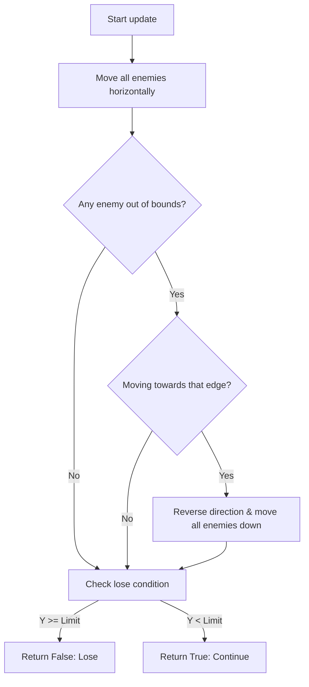

# Plan: Fix Enemy Movement Oscillation

## Context
In the current implementation of `EnemyWave.ts`, the enemies move horizontally and then check if they have hit the edge. However, the logic for reversing direction and dropping down is flawed, leading to an oscillation at the boundaries. Specifically, once an enemy hits a boundary, it triggers a direction reversal and a drop every frame until it moves away from the boundary. But because the direction reverses every frame, it never successfully moves away, causing it to "slide" down the boundary to the bottom.

## Root Cause Analysis
The `update` method in `EnemyWave.ts` checks for edge collisions regardless of the current movement direction:
```typescript
if (bounds.x <= 0 || bounds.x + enemy.getBounds().width >= this.canvasWidth) {
    hitEdge = true;
}
```
If an enemy is at `x=0` and moving left, `hitEdge` becomes true, direction reverses to right.
In the next frame, the enemy is still at (or very near) `x=0`, but now it is moving right. The condition `bounds.x <= 0` is still true, so `hitEdge` becomes true AGAIN, direction reverses back to left, and it drops again.

## Proposed Solution
Modify the edge detection logic to be direction-aware. An edge hit should only be registered if the wave is moving *towards* that edge.

### High-Level Changes
1. Update `EnemyWave.update()` to only trigger `hitEdge` if:
   - It hits the left edge AND is moving left.
   - It hits the right edge AND is moving right.
2. Refactor the `update` loop to improve clarity and ensure bounds are checked after movement.

## Detailed Implementation Plan

### 1. Modify `EnemyWave.ts`
- Update the `hitEdge` detection logic inside the `update` method.
- Ensure the loop checks the current direction against the boundary being hit.

### 2. Implementation Steps
1. **Refactor `update` Loop**:
   - Move all enemies horizontally first.
   - Perform a separate pass to check if any enemy has reached a boundary *in the direction of movement*.
   - If a boundary is reached, set the `hitEdge` flag.
2. **Handle `hitEdge`**:
   - Reverse `this.direction`.
   - Move all enemies down by `this.dropDistance`.
3. **Verification**:
   - Ensure the wave moves right, hits the right edge, drops once, and then moves left.
   - Ensure the wave moves left, hits the left edge, drops once, and then moves right.

## Mermaid Diagram



## File to modify
- `src/ts/entities/EnemyWave.ts`
