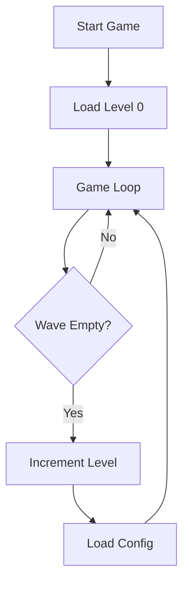

# Level System Implementation Plan

## Overview
Implement a JSON-based level configuration system with immediate transitions and scaling enemy speed.

## High-Level Approach
1.  **Level Data**: Store level parameters in a JSON configuration file.
2.  **State Management**: Track the current level in the `Game` class and handle transitions.
3.  **Speed Scaling**: Modify `EnemyWave` to increase velocity when shifting rows.
4.  **UI Feedback**: Display the current level number on the game screen.

## Detailed Steps

### 1. Configuration Setup
- Create `src/assets/levels.json` with an array of level configurations:
    - `rows`: number of rows.
    - `cols`: number of columns.
    - `speed`: base horizontal speed.
    - `spacingX`/`spacingY`: distance between enemies.
    - `dropDistance`: vertical drop amount.
- Include Level 0 as the first entry: `{"rows": 5, "cols": 6, "speed": 1.0, "spacingX": 60, "spacingY": 50, "dropDistance": 20}`.

### 2. Update `EnemyWave` Entity
- Open [`src/ts/entities/EnemyWave.ts`](src/ts/entities/EnemyWave.ts).
- Change `speed` from `readonly` to `private`.
- Update `update()` method:
    - Inside the `if (hitEdge)` block, add logic to increase speed: `this.speed *= 1.001`.
    - Ensure `this.speed` is used for horizontal movement.

### 3. Update `Game` Orchestrator
- Open [`src/ts/Game.ts`](src/ts/Game.ts).
- Add `private currentLevel: number = 0`.
- Import the levels array from the JSON configuration.
- Implement `initLevel(levelIndex: number)`:
    - Determine which config to use: `levels[Math.min(levelIndex, levels.length - 1)]`.
    - Instantiate `EnemyWave` using parameters from the selected config.
    - Reset bullets and other transient state if necessary (keeping player position).
- Refactor `constructor` and `reset()` to use `initLevel(0)`.
- Update `update()` method:
    - When `this.enemyWave.isEmpty()` is true, call `this.currentLevel++` and then `this.initLevel(this.currentLevel)`.
    - Do NOT set `gameRunning = false` on wave completion; transitions should be immediate.

### 4. UI Implementation
- Update `render()` method in [`src/ts/Game.ts`](src/ts/Game.ts):
    - Add a `fillText` call to display `Level: ${this.currentLevel}` at the top right (e.g., `x = this.canvas.width - this.PADDING`).

### 5. Verification
- Verify that Level 0 matches initial requirements.
- Verify that killing all enemies triggers the next wave.
- Verify that speed increases when enemies hit the screen edges.

## Mermaid Workflow

