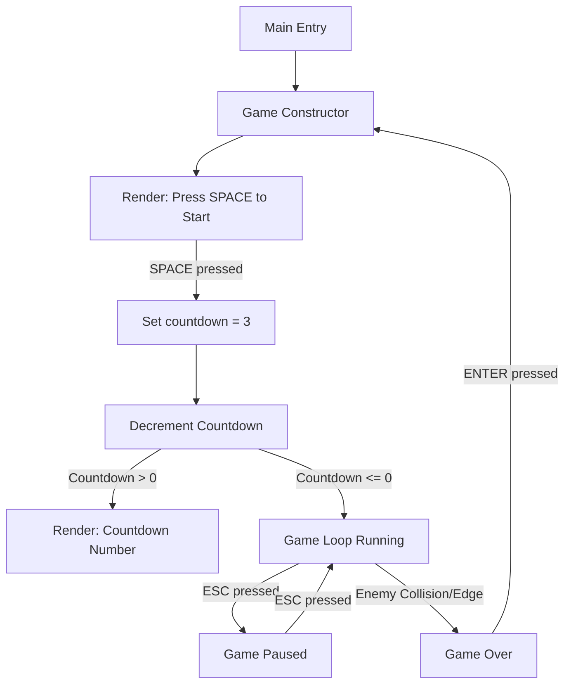

# Implementation Plan - TODO-5

This plan addresses the bug fixes and features requested in `20251226-todo-5.md`.

## 1. Fix `enemyHealth` Bug
**Issue:** Enemies are always killed at 1st shoot, and visual health is always 1.
**Analysis:** 
- [`Game.initLevel()`](src/ts/Game.ts:155) calls [`resolveLevelConfig()`](src/ts/Game.ts:98) which returns a `LevelConfig` containing `enemyHealth`.
- However, [`Game.initLevel()`](src/ts/Game.ts:155) passes an `EnemyWaveConfig` to the `EnemyWave` constructor, but this config interface [`EnemyWaveConfig`](src/ts/entities/EnemyWave.ts:6) is missing the `enemyHealth` property.
- [`EnemyWave.initializeEnemies()`](src/ts/entities/EnemyWave.ts:36) creates `Enemy` instances using `new Enemy(x, y)`, which defaults health to 1.

**Changes:**
- **File:** [`src/ts/entities/EnemyWave.ts`](src/ts/entities/EnemyWave.ts)
    - Update `EnemyWaveConfig` to include `enemyHealth: number`.
    - Update `initializeEnemies` to pass `config.enemyHealth` to the `Enemy` constructor.
- **File:** [`src/ts/Game.ts`](src/ts/Game.ts)
    - In `initLevel`, pass `levelConfig.enemyHealth` into the `enemyConfig` object.

## 2. Debug Level Configuration Display
**Feature:** Show level configuration at the left of the game area.
**Changes:**
- **File:** [`src/ts/constants.ts`](src/ts/constants.ts)
    - Add `export const SHOW_DEBUG_INFO = true;`.
- **File:** [`src/ts/Game.ts`](src/ts/Game.ts)
    - Add a `private currentLevelConfig: LevelConfig | null = null;` property.
    - Update `initLevel` to store the resolved config in `this.currentLevelConfig`.
    - Update `render()` to draw the debug info if `SHOW_DEBUG_INFO` is true.

## 3. Pause State (ESC Key)
**Feature:** Press ESC to pause the game and show a note.
**Changes:**
- **File:** [`src/ts/Game.ts`](src/ts/Game.ts)
    - Add `private isPaused: boolean = false;`.
    - Update `update()` to toggle `isPaused` when ESC is pressed (needs to handle edge-triggering or use a flag to prevent rapid toggling).
    - If `isPaused` is true, skip update logic (except for unpausing).
    - Update `render()` to show "PAUSED - Press ESC to resume" at the middle bottom.

## 4. Game Start Trigger (SPACE Key)
**Feature:** Game should not start directly. Show "Press SPACE to start".
**Changes:**
- **File:** [`src/ts/Game.ts`](src/ts/Game.ts)
    - Add `private hasStarted: boolean = false;`.
    - Update `update()`: if `!hasStarted`, check for SPACE to set `hasStarted = true`.
    - Update `render()`: if `!hasStarted`, show the start message.

## 5. Countdown Timer
**Feature:** 3s countdown when game starts.
**Changes:**
- **File:** [`src/ts/Game.ts`](src/ts/Game.ts)
    - Add `private countdown: number = 0;`.
    - When `hasStarted` becomes true, set `countdown = 3` (seconds).
    - Update `update()`: if `countdown > 0`, decrement it based on deltaTime (or frames).
    - Update `render()`: if `countdown > 0`, show the countdown number prominently.

## Mermaid Workflow

## Summary of Files to Modify
- [`src/ts/constants.ts`](src/ts/constants.ts)
- [`src/ts/entities/EnemyWave.ts`](src/ts/entities/EnemyWave.ts)
- [`src/ts/Game.ts`](src/ts/Game.ts)
