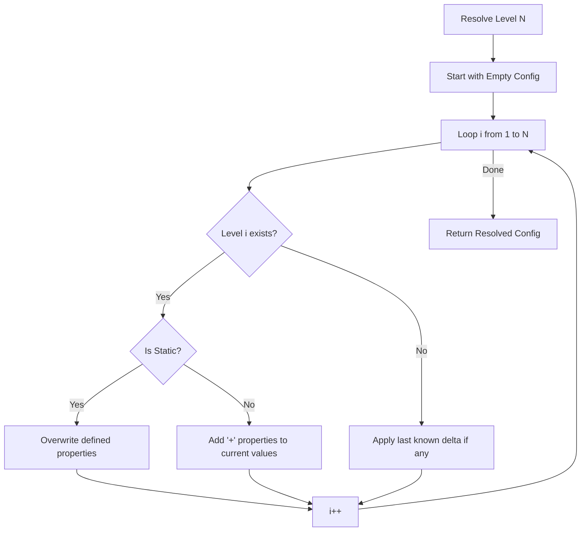

# Headless Testing Plan: Level Configuration & Infinity Fallback (V2)

This plan outlines the updated requirements for level configuration testing, incorporating the *intended* mathematical behavior which is currently broken in `Game.ts`.

## Discrepancy Analysis

### 1. The Inheritance Bug
**Current Behavior**: Static levels (those without `+` prefixes) reset the entire configuration. If a static level is sparse (missing properties), those properties are lost (become `undefined`).
**Intended Behavior**: Every level should inherit the *resolved* state of the previous level. A static level should only overwrite specific properties it defines, preserving others from the resolved state of the previous level.

### 2. The Infinity Accumulation Bug
**Current Behavior**: The loop in `resolveLevelConfig` applies the last known delta for *every* level beyond the max defined level. However, because it filters the *entire* list of levels for each iteration, it can apply the same delta multiple times if not careful. 
Actually, the bug is that it starts applying the delta from the level it's defined at, for every level index in the loop.
Example: If Level 3 is `+speed: 0.5`, and we want Level 5:
- `i=3`: applies L3 delta (+0.5)
- `i=4`: applies L3 delta (+0.5)
- `i=5`: applies L3 delta (+0.5)
Total: +1.5. This seems correct for infinity, BUT it relies on Level 2 having been "Static". If Level 2 was also a delta, the logic gets even more complex.

## Test Data (Mock)
```json
{
  "1": {
    "rows": 5,
    "cols": 6,
    "speed": 1.0,
    "enemyCount": 30,
    "enemyHealth": 1,
    "enemyTypes": { "red": 100 }
  },
  "2": {
    "rows": 6,
    "cols": 8
  },
  "3": {
    "+speed": 0.5,
    "+enemyHealth": 1
  }
}
```

## Mathematically Correct Expectations (Failing Assertions)

The following table represents the **Intended** behavior. Tests should be updated to assert these values, which will cause them to FAIL against the current buggy implementation.

| Level | `rows` | `cols` | `speed` | `enemyHealth` | `enemyCount` | `enemyTypes` | Notes |
|-------|--------|--------|---------|---------------|--------------|--------------|-------|
| **1** | 5 | 6 | 1.0 | 1 | 30 | `{red: 100}` | Base level |
| **2** | 6 | 8 | **1.0** | **1** | **30** | **{red: 100}** | **SHOULD INHERIT** (Currently `undefined`) |
| **3** | 6 | 8 | **1.5** | **2** | **30** | **{red: 100}** | **SHOULD ACCUMULATE** on inherited (Currently `0.5`, `1`, `undef`) |
| **4** | 6 | 8 | **2.0** | **3** | **30** | **{red: 100}** | Infinity Level 1 (Currently `1.0`, `2`, `undef`) |

## Updated Todo List for Implementation

1. **Update Tests to Assert Intended Values**:
    - Level 2: Expect inheritance of `speed`, `enemyCount`, `enemyHealth`, `enemyTypes`.
    - Level 3: Expect accumulation on top of inherited Level 2 values.
    - Level 4+: Expect linear accumulation on top of inherited values.
2. **Verify Failures**: Run `npm run test` and confirm that tests fail with the specific discrepancies identified.
3. **Fix Logic (Next Task)**: Once the plan is approved and tests are failing, the logic in `resolveLevelConfig` needs to be refactored to:
    - Iteratively resolve levels from 1 to `targetLevel`.
    - Each level starts with the resolved state of the previous level.
    - Static levels overwrite.
    - Delta levels add.

## Mermaid Flow of Intended Logic


