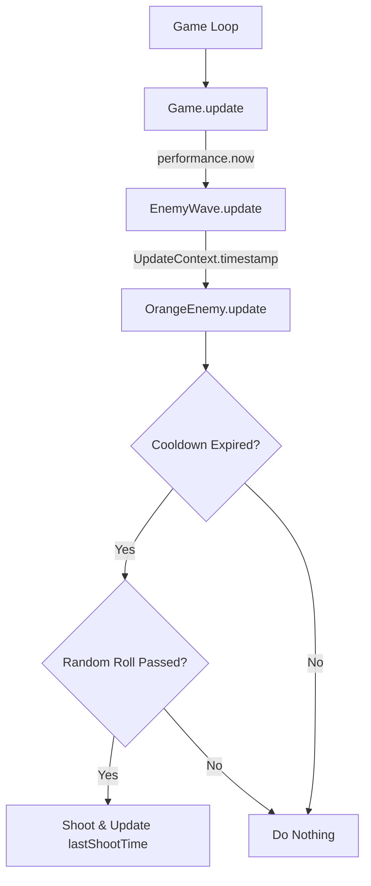

# Plan: Orange Enemy Shoot Frequency Fix

This plan outlines the steps to limit the shooting frequency of `OrangeEnemy` to no more than 1 time per minute (60 seconds).

## Current State Analysis
- `src/ts/entities/OrangeEnemy.ts`: Decides to shoot using `Math.random() < ENEMY_SHOOT_CHANCE` in every `update()` call.
- `src/ts/constants.ts`: `ENEMY_SHOOT_CHANCE` is set to `0.002`.
- At 60 FPS, this result in approximately 7.2 shots per minute on average.
- `UpdateContext` lacks timestamp information, which is needed for time-based cooldowns.

## High-Level Approach
1.  **Introduce Time Tracking**: Modify `UpdateContext` and `EnemyWave.update()` to pass the current timestamp from the game loop to the enemies.
2.  **Add Cooldown Constant**: Define `ORANGE_SHOOT_COOLDOWN` in `constants.ts`.
3.  **Implement Cooldown Logic**: Add a `lastShootTime` property to `OrangeEnemy` and use it to gate shooting.

## Detailed Step-by-Step Plan

### 1. Git Preparation
- Create a new branch for the fix.
```bash
git checkout -b fix/orange-enemy-shoot-frequency
```

### 2. Modify `UpdateContext` and `Enemy` Base Class
- File: `src/ts/entities/Enemy.ts`
- Add `timestamp: number` to `UpdateContext` interface.

```typescript
// src/ts/entities/Enemy.ts
export interface UpdateContext {
  playerX: number;
  playerY: number;
  timestamp: number; // New field
  spawnBullet(x: number, y: number, isPlayer: boolean, vx?: number, vy?: number, isOrangeBullet?: boolean): void;
}
```

### 3. Update `EnemyWave` and `Game` Loop
- File: `src/ts/entities/EnemyWave.ts`
- Update `update()` method signature and context creation.

```typescript
// src/ts/entities/EnemyWave.ts
public update(playerX: number, playerY: number, timestamp: number): WaveUpdateResult {
  // ...
  const context: UpdateContext = {
    playerX,
    playerY,
    timestamp, // Pass timestamp to context
    spawnBullet: (x: number, y: number, isPlayer: boolean, vx?: number, vy?: number, isOrangeBullet?: boolean) => 
      pendingBullets.push({ x, y, isPlayer, vx, vy, isOrangeBullet })
  };
  // ...
}
```

- File: `src/ts/Game.ts`
- Pass `performance.now()` in `update()`.

```typescript
// src/ts/Game.ts
public update(deltaTime: number): void {
  // ...
  const waveResult = this.enemyWave.update(
    this.player.getBounds().x + this.player.getBounds().width / 2,
    this.player.getBounds().y,
    performance.now() // Pass current timestamp
  );
  // ...
}
```

### 4. Define Cooldown Constant
- File: `src/ts/constants.ts`
- Add `ORANGE_SHOOT_COOLDOWN`.

```typescript
// src/ts/constants.ts
export const ORANGE_SHOOT_COOLDOWN = 60000; // 60 seconds in ms
```

### 5. Implement Cooldown in `OrangeEnemy`
- File: `src/ts/entities/OrangeEnemy.ts`
- Add `lastShootTime` and check it before shooting.

```typescript
// src/ts/entities/OrangeEnemy.ts
import { ORANGE_SHOOT_COOLDOWN, ... } from '../constants';

export class OrangeEnemy extends Enemy {
  private lastShootTime: number = 0;

  public update(context: UpdateContext): void {
    const canShoot = context.timestamp - this.lastShootTime >= ORANGE_SHOOT_COOLDOWN;
    
    if (canShoot && Math.random() < ENEMY_SHOOT_CHANCE) {
      // ... existing shooting logic ...
      this.lastShootTime = context.timestamp;
    }
  }
}
```

### 6. Verification
- Run the game and observe Orange enemies. They should shoot very infrequently (at most once per minute).
- Add a temporary console log to `OrangeEnemy.update` to verify `canShoot` logic and actual firing interval.
- Run existing tests to ensure no regressions.
```bash
npm run test
```

### 7. Git Finalization
- Commit changes.
```bash
git add .
git commit -m "fix: limit orange enemy shoot frequency to 1 shot per minute"
```

## Mermaid Workflow


