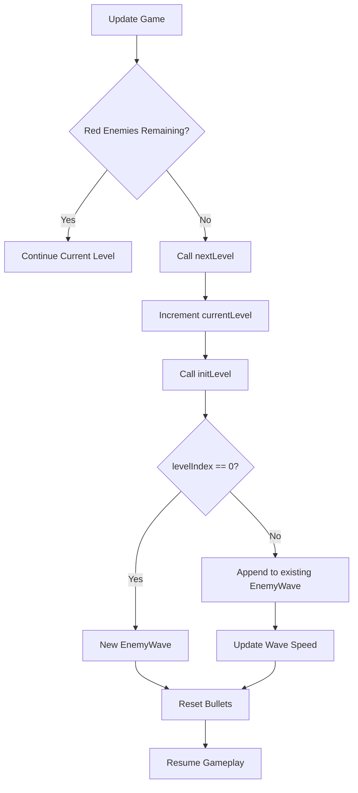

# Plan: Preserve Surviving Enemies on Level End

Currently, levels in Space Invaders end when all Red enemies are cleared. When this happens, a new level is initialized, which completely replaces the existing `EnemyWave` and its remaining enemies (Yellow, Orange, Violet). This plan outlines how to modify the game to preserve these surviving enemies during level transitions.

## High-Level Approach

1.  **Modify `EnemyWave.ts`**: Add a `setSpeed` method to allow updating the wave's baseline speed when a new level starts.
2.  **Modify `Game.ts`**: Update the `initLevel` method to detect if it's being called during a level transition (as opposed to a game reset). If so, append the new level's enemies to the existing `EnemyWave` instead of creating a new one.
3.  **Preserve State**: Ensure surviving enemies keep their positions and behavior.
4.  **Verification**: Add a test case to verify that non-red enemies are preserved across level transitions.

## Detailed Steps

### 1. Git Preparation
- Create a new branch for this feature.
- Commit current state if there are pending changes.

### 2. Implementation

#### 2.1. Update `EnemyWave.ts`
- File: `src/ts/entities/EnemyWave.ts`
- Add a `setSpeed` method to update the wave's speed.

```typescript
// src/ts/entities/EnemyWave.ts

public setSpeed(speed: number): void {
  this.speed = speed;
}
```

#### 2.2. Update `Game.ts`
- File: `src/ts/Game.ts`
- Modify `initLevel(levelIndex: number)` to handle transitions.

```typescript
// src/ts/Game.ts

private initLevel(levelIndex: number): void {
  const config = this.resolveLevelConfig(levelIndex + 1);
  this.currentLevelConfig = config;

  const waveConfig = {
    canvasWidth: CANVAS_WIDTH,
    canvasHeight: CANVAS_HEIGHT,
    cols: config.cols,
    rows: config.rows,
    spacingX: ENEMY_SPACING_X,
    spacingY: ENEMY_SPACING_Y,
    startX: ENEMY_WAVE_START_X,
    startY: ENEMY_WAVE_START_Y,
    speed: config.speed,
    dropDistance: ENEMY_DROP_DISTANCE,
    enemyCount: config.enemyCount,
    enemyHealth: config.enemyHealth,
    enemyTypes: config.enemyTypes
  };

  if (levelIndex === 0 || !this.enemyWave) {
    // New game or reset: create a fresh wave
    this.enemyWave = new EnemyWave(waveConfig);
  } else {
    // Level transition: preserve existing enemies and spawn new ones
    this.enemyWave.spawnEnemies(waveConfig);
    this.enemyWave.setSpeed(config.speed);
  }
  
  this.bullets = [];
}
```

### 3. Verification

#### 3.1. Manual Verification
1.  Run the game using `npm run dev`.
2.  Play until a level has non-red enemies (e.g., Yellow or Orange).
3.  Clear all Red enemies.
4.  Observe that Yellow/Orange enemies remain on screen and continue their behavior while new Red enemies spawn at the top.

#### 3.2. Automated Testing
- Add a new test case to `src/ts/__tests__/Game.test.ts` (or a separate file) to verify preservation.

```typescript
// Example test logic (pseudo-code for Vitest)
it('preserves surviving non-red enemies during level transition', () => {
  const game = new Game();
  // Manually add a Yellow enemy to the wave
  const yellowEnemy = new YellowEnemy(100, 100, 1);
  game['enemyWave'].getEnemies().push(yellowEnemy);
  
  // Transition to next level
  game['nextLevel']();
  
  // Verify yellowEnemy is still in the wave
  expect(game['enemyWave'].getEnemies()).toContain(yellowEnemy);
});
```

### 4. Git Finalization
- Commit the changes.
- Merge the branch (if applicable).

## Mermaid Diagram: Level Transition Flow


