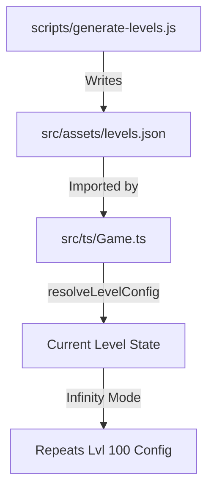

# Implementation Plan: Update Levels Configuration (1 to 100 Levels)

This plan outlines the steps required to update the game's level configuration from 1000 levels to 100 levels, with a smoother and slightly increased difficulty curve. It also includes steps for optimizing the `levels.json` file by removing redundant entries.

## 1. Goal
1. Update [`src/assets/levels.json`](src/assets/levels.json) to configure up to level 100.
2. Implement a new difficulty scaling logic in [`scripts/generate-levels.js`](scripts/generate-levels.js).
3. Ensure no redundant level entries (levels identical to their predecessor) are stored in the JSON.
4. Run the generation script and verify results.

## 2. Analysis Summary
- **Current State**: 1000 levels defined via additive `+speed` and milestone-based property changes.
- **Redundancy**: Many levels only add a small speed increment. The game logic uses the last available config, so if a level adds nothing, it's redundant.
- **Infinity Mode**: [`src/ts/Game.ts:resolveLevelConfig()`](src/ts/Game.ts:74) dynamically detects the last available level and uses it for all subsequent levels. Reducing to 100 levels will automatically trigger infinity mode at level 101.

## 3. Proposed Scaling Logic (100 Levels)

| Parameter | Start (Lvl 1) | End (Lvl 100) | Logic |
|-----------|---------------|---------------|-------|
| Rows | 5 | 10 | `Math.min(5 + Math.floor((lvl-1)/10), 10)` |
| Columns | 6 | 15 | `Math.min(6 + Math.floor((lvl-1)/11), 15)` |
| Speed Increment | 0.05 | 0.02 | L1-20: 0.05, L21-50: 0.03, L51-100: 0.02 |
| Enemy Health | 1 | 5 | `1 + Math.floor((lvl-1)/25)` |

### Enemy Type Milestones
- **Level 1**: 100% Red
- **Level 10**: 90% Red, 10% Yellow
- **Level 25**: 80% Red, 15% Yellow, 5% Orange
- **Level 50**: 70% Red, 20% Yellow, 7% Orange, 3% Violet
- **Level 75**: 50% Red, 25% Yellow, 15% Orange, 10% Violet
- **Level 100**: 20% Red, 30% Yellow, 30% Orange, 20% Violet

## 4. Step-by-Step Implementation

### Step 1: Backup Current Configuration
Create a backup of the current `levels.json` before any changes.
```bash
cp src/assets/levels.json src/assets/levels.json.bak
```

### Step 2: Update `scripts/generate-levels.js`
Modify the generator script to implement the new logic.

```javascript
// scripts/generate-levels.js modifications

function getSpeedInc(level) {
  if (level <= 20) return 0.05;
  if (level <= 50) return 0.03;
  return 0.02;
}

function getRows(level) {
  return Math.min(5 + Math.floor((level - 1) / 10), 10);
}

function getCols(level) {
  return Math.min(6 + Math.floor((level - 1) / 11), 15);
}

function getHealth(level) {
  return 1 + Math.floor((level - 1) / 25);
}

const typeMilestones = {
  1: { red: 100 },
  10: { red: 90, yellow: 10 },
  25: { red: 80, yellow: 15, orange: 5 },
  50: { red: 70, yellow: 20, orange: 7, violet: 3 },
  75: { red: 50, yellow: 25, orange: 15, violet: 10 },
  100: { red: 20, yellow: 30, orange: 30, violet: 20 }
};

// ... update loop to 100 ...
for (let level = 1; level <= 100; level++) {
    // ... generation logic ...
}
```

### Step 3: Run the Level Generator
Execute the script to overwrite the current `levels.json`.
```bash
node scripts/generate-levels.js
```

### Step 4: Verification of `src/assets/levels.json`
Inspect the generated file to ensure:
- It ends at key "100".
- Redundant levels are omitted (if applicable).
- Difficulty parameters scale as expected.

### Step 5: Update Documentation and Constants
- Update [`docs/levels-config.md`](docs/levels-config.md) to reflect the new 100-level cap and scaling.
- Ensure [`src/ts/constants.ts`](src/ts/constants.ts) doesn't have any conflicting hardcoded values (none found during analysis).

## 5. Testing Plan
1. **Manual Level Skipping**: Temporarily modify `Game.ts` to start at level 95 to test the end-game difficulty.
2. **Infinity Mode Check**: Verify the game continues after level 100 using level 100's config.
3. **Property Verification**: Check in console logs (if debug mode is on) that health and enemy counts increase at levels 10, 25, 50, etc.

## 6. Architecture Review



## 7. Documentation
Update the Memory Bank (`context.md`) and project documentation to reflect the new level structure.
