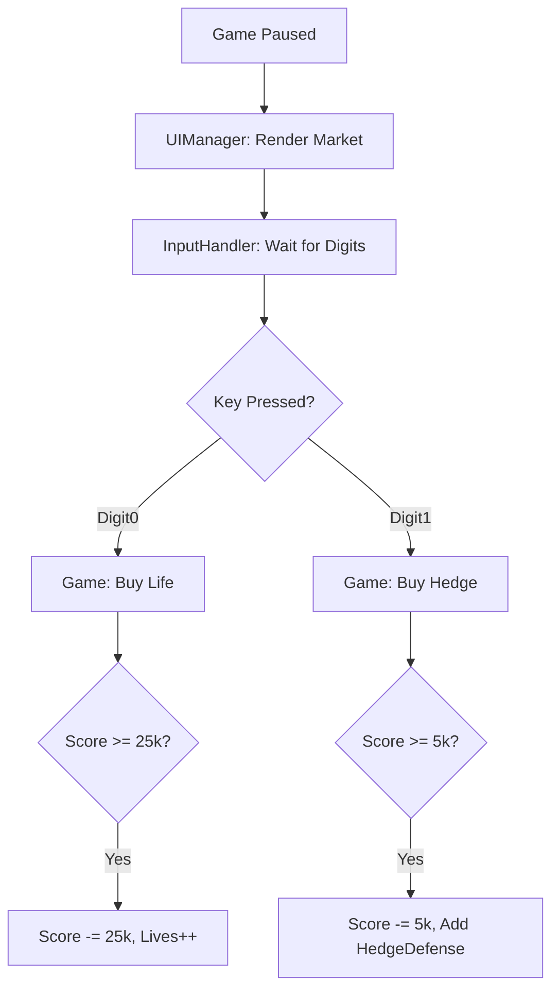

# Player's Market Space Implementation Plan

## 1. Goal
Implement a buyable items system (Market) accessible via the Pause screen, allowing players to exchange points for benefits like extra lives or hedge defenses.

## 2. Technical Approach

### 2.1. Market Item Definitions
Define a standard structure for market items.
```typescript
interface MarketItem {
  index: number;
  name: string;
  symbol: string;
  price: number;
}
```

### 2.2. UI Enhancements
- Update [`src/ts/constants.ts`](src/ts/constants.ts):
  - `LABEL_PAUSE` = 'Press ESC to Pause & Access Market'
- Update [`src/ts/UIManager.ts`](src/ts/UIManager.ts):
  - In `renderOverlays`, add a `renderMarket()` helper.
  - Render a grid showing item details: Index, Name, Symbol, Price.
  - Render symbols geometrically (dot for Life, line for Hedge).

### 2.3. Purchase Logic in Game.ts
- Update [`src/ts/Game.ts`](src/ts/Game.ts):
  - Add `buyItem(index: number)` method.
  - Update `handlePauseAndStart` to listen for `Digit0` through `Digit9`.
  - Deduct score and trigger the item's effect (e.g., adding a life or a hedge defense).

### 2.4. Hedge Defense Entity
- Create [`src/ts/entities/HedgeDefense.ts`](src/ts/entities/HedgeDefense.ts).
- Manages its own `y` position and `active` state.
- Max 10 defenses at once.
- Collision logic in [`src/ts/CollisionManager.ts`](src/ts/CollisionManager.ts).

## 3. Step-by-Step Implementation

### Step 1: Constants & Types
- [ ] Update [`src/ts/constants.ts`](src/ts/constants.ts):
  - Set `LABEL_PAUSE = 'Press ESC to Pause & Access Market'`.
  - Add `HEDGE_COLOR = '#00ff00'`.
  - Add `HEDGE_HEIGHT = 2`.
  - Add `HEDGE_MAX_COUNT = 10`.
  - Add `HEDGE_START_Y_OFFSET = 100`.
  - Add `HEDGE_SPACING = 20`.
  - Add `MARKET_ITEM_LIFE_PRICE = 25000`.
  - Add `MARKET_ITEM_HEDGE_PRICE = 5000`.

### Step 2: Hedge Defense Class
- [ ] Implement [`src/ts/entities/HedgeDefense.ts`](src/ts/entities/HedgeDefense.ts):
  - Properties: `y: number`, `active: boolean`.
  - Constructor takes `y`.
  - Method: `draw(ctx: CanvasRenderingContext2D)`.

### Step 3: Game Class Updates
- [ ] Add `private hedgeDefenses: HedgeDefense[] = []` to [`src/ts/Game.ts`](src/ts/Game.ts).
- [ ] Implement `private purchaseItem(index: number): void`:
  - Check score vs price.
  - If Index 0 (+1 Life): Call `this.player.addLife()`.
  - If Index 1 (Hedge DEF): Add new `HedgeDefense` to `this.hedgeDefenses`.
    - Position: `CANVAS_HEIGHT - PLAYER_START_Y_OFFSET - HEDGE_START_Y_OFFSET - (hedgeCount * HEDGE_SPACING)`.
- [ ] Update `handlePauseAndStart()` to detect digit keys and call `purchaseItem()`.

### Step 4: Collision Manager Updates
- [ ] Update `CollisionContext` in [`src/ts/CollisionManager.ts`](src/ts/CollisionManager.ts) to include `hedgeDefenses`.
- [ ] In `handleCollisions`, iterate through all enemies and active hedge defenses.
- [ ] If an enemy intersects a hedge (Enemy Y + Height >= Hedge Y):
  - Kill enemy (call `scoreCallback`).
  - Set hedge to inactive.
  - Remove inactive hedges from the array in `Game.update`.

### Step 5: UI Rendering
- [ ] Update [`src/ts/UIManager.ts`](src/ts/UIManager.ts):
  - Add `renderMarket(ctx, state)` method called from `renderOverlays` when paused.
  - Draw a centered table with "Market" title and instructions.
  - Draw rows for each item.
- [ ] Update [`src/ts/Renderer.ts`](src/ts/Renderer.ts):
  - Add logic to draw active hedge defenses.

## 4. Item Details

| Index | Name | Symbol | Price | Effect |
|---|---|---|---|---|
| 0 | +1 Life | Green Dot | 25,000 | `player.lives++` |
| 1 | Hedge DEF | Green Horizontal Line | 5,000 | Add a new horizontal defense line |

## 5. Mermaid Diagram


