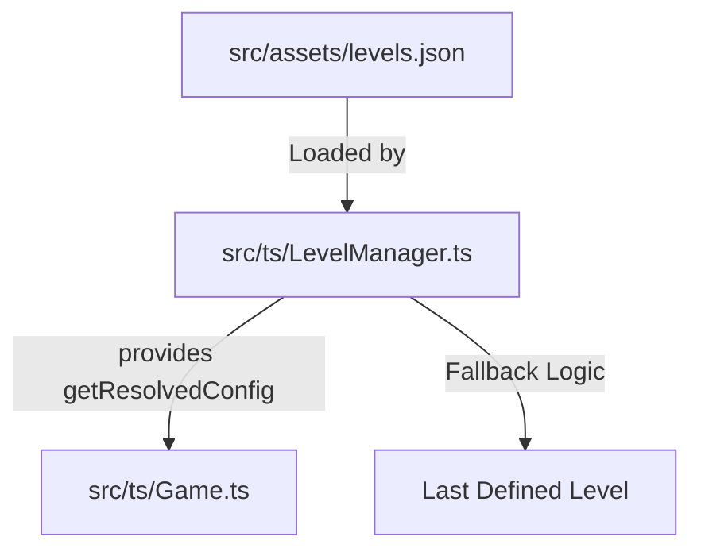

# Plan: Simplify Level Configuration and Loading Behavior

This plan outlines the steps to simplify the level configuration system by removing delta accumulation logic and switching to direct lookup with a fallback to the last defined level.

## User Constraints

> [!WARNING]
> - **DO NOT** modify `scripts/generate-levels.js`.
> - **DO NOT** modify `src/assets/levels.json`.

## Updated Objective

1. **Refactor `LevelManager.ts`**:
    - Implement direct lookup from `levels.json`.
    - Fallback: If a level is not defined, use the last defined level in the JSON (Level 100).
    - Validation: Throw an error if any required property (`rows`, `cols`, `speed`, `enemyCount`, `enemyHealth`) is missing in the resolved config.
    - Remove all sparse resolution, delta accumulation, and prefix (`+`) logic.
2. **Update Unit Tests**:
    - Verify strict loading behavior.
    - Verify fallback to the last defined level.
    - Verify error handling for missing properties.

## Proposed Architecture

## Step-by-Step Implementation

### 1. Level Manager Refactoring
- [ ] **Simplify `src/ts/LevelManager.ts`**:
    - Remove `DEFAULTS`, `getSortedLevelKeys`, `getNearestDefinedLevel`, `configHasDeltas`, `findLastNonDeltaLevel`, `accumulateNonDeltaConfigs`, `overrideNonDeltaProps`, and `applyDeltas`.
    - Update `getResolvedConfig(targetLevel: number)`:
        - Direct lookup: `let config = this.levelsData[targetLevel.toString()]`.
        - Fallback: If `config` is undefined, find the highest numeric key in `this.levelsData` and use its configuration.
        - Implement `validateConfig(config)` to check for:
            - `rows`
            - `cols`
            - `speed`
            - `enemyCount`
            - `enemyHealth`
        - Throw `Error` if any property is `undefined`.
- [ ] **Update `LevelConfig` interface**:
    - Keep it consistent with the required properties.

### 2. Verification & Testing
- [ ] **Update tests**:
    - Review `src/ts/__tests__/LevelManager.test.ts` (or create if missing).
    - Add test cases for:
        - Successful lookup of an existing level.
        - Fallback to level 100 when requesting level 101+.
        - Fallback to level 100 if a level <= 100 is missing (if applicable, though JSON is currently full).
        - Error throwing when a config is missing a required property.
- [ ] **Run all tests**:
    - Execute `npm run test`.

### 3. Documentation Cleanup
- [ ] **Update `docs/levels-config.md`**:
    - Remove sections describing sparse levels and delta (`+`) properties.
    - Document the new direct lookup and fallback behavior.

## Definition of Done
- `LevelManager.ts` is simplified and free of delta/sparse logic.
- The game correctly loads levels from `levels.json`.
- Levels not in `levels.json` fallback to the last defined level.
- Missing properties in the resolved configuration trigger explicit errors.
- All unit tests pass.
